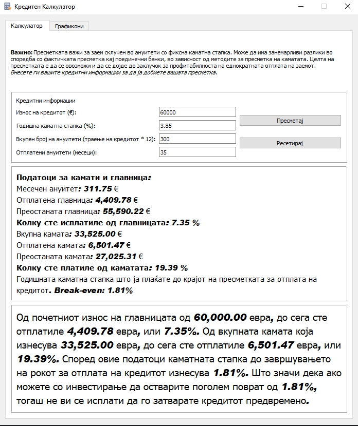
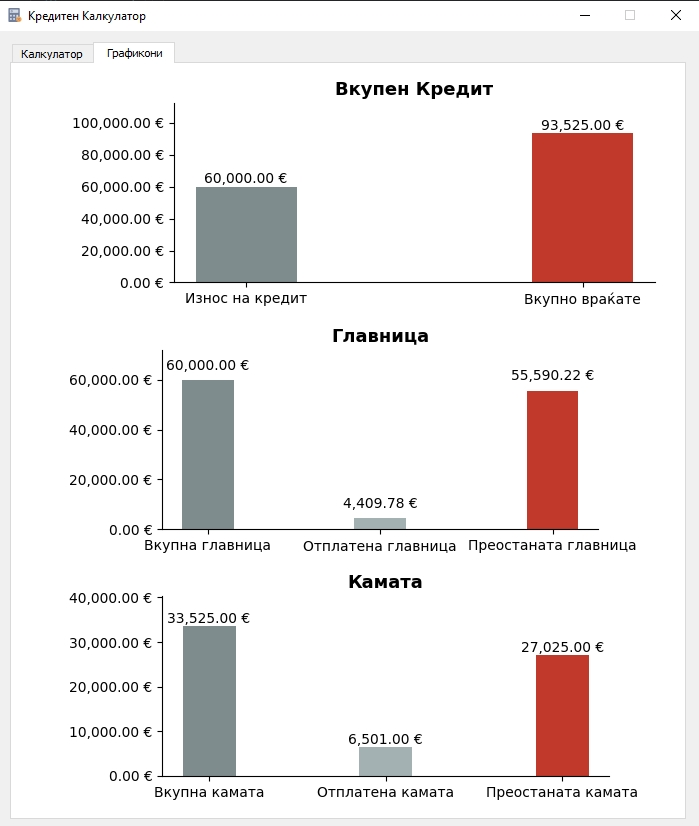

# Калкулатор за Кредити

Едноставен и практичен калкулатор за пресметка на месечни рати за кредити како и свое мислење дали е исплатлво предвремено враќање на истиот. Овој калкулатор ќе ви помогне да го разберете вашиот кредитен план и месечните обврски.

## Карактеристики
- Пресметка на месечна рата врз основа на износот на кредитот, каматната стапка и рокот на отплата.
- Поддржува фиксни каматни стапки.
- Интуитивен интерфејс на македонски јазик.

## Слики

### Главен Екран

### Графикон

## Како да го користите
1. Внесете го износот на кредитот.
2. Внесете ја годишната каматна стапка (во проценти).
3. Внесете го бројот на месеци за отплата.
4. Притиснете "Пресметај" за да ја добиете месечната рата.

## Барања
- **Оперативен систем**: windows
- **Јазик**: Python pyqt5.

## Инсталација
1. Преземете ја апликацијата од [https://github.com/kalco/Loan-Calc/releases/tag/1.0.0](#).
2. Стартувајте го калкулаторот.

## Лиценца
Овој проект е лиценциран под MIT лиценцата.

